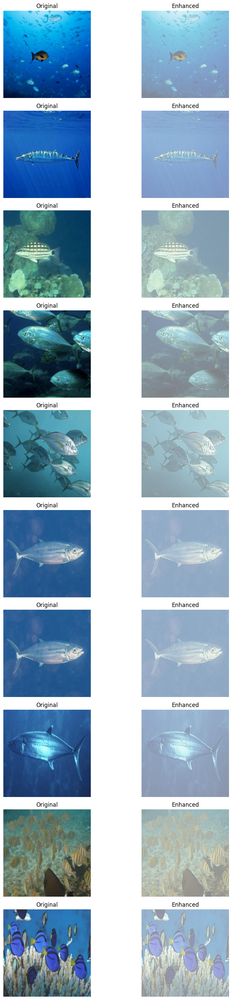
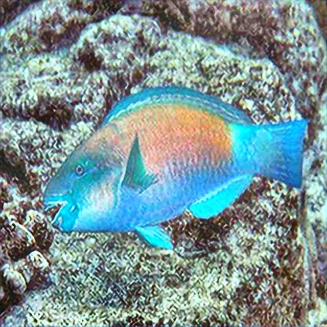

# 🌊 DeepSeaVision

> **GAN-based underwater image enhancement using custom SRGAN architecture with perceptual loss.**

Underwater images suffer from severe degradation — color distortion, haze, low contrast, and poor visibility caused by light absorption and scattering. DeepSeaVision tackles this with a custom SRGAN-style generator trained on paired underwater scenes, restoring visual clarity good enough for downstream marine analysis tasks.

---

## Results

**Before → After (model output)**



**Post-processed output**



---

## Architecture

### Generator — `GeneratorUSRGAN`
- **Input/Output:** RGB image → enhanced RGB image
- 9×9 initial conv for broad feature extraction
- 16 residual blocks for deep feature learning
- Global skip connection to preserve image structure
- 9×9 final conv + `tanh` activation for normalized output

### Discriminator
- Stacked conv layers with LeakyReLU + BatchNorm
- Adaptive average pooling → fully connected classifier
- Outputs real/fake probability per image

### Loss Function
```
L_total = λ1 * L1_content + λ2 * VGG19_perceptual + λ3 * adversarial_GAN
```
The perceptual loss uses frozen VGG-19 features to optimize for visual realism, not just pixel accuracy.

---

## Dataset

Uses the **EUVP paired underwater scenes** dataset.

```
underwater_scenes/
├── trainA/        # Low-quality underwater images
├── trainB/        # High-quality reference images
└── validation/    # Validation images
```

Update `dataset_path` in `dataloader.py` if running locally:
```python
dataset_path = "/your/local/path/underwater_scenes"
```

---

## Quickstart

### Install dependencies
```bash
pip install torch torchvision pillow matplotlib numpy
```

> Requires Python 3.9+, PyTorch, and a CUDA-enabled GPU for training.

### Train
```bash
python train.py
```

**Training config:**
| Parameter | Value |
|-----------|-------|
| Epochs | 50 |
| Batch size | 2 |
| Optimizer | Adam |
| Learning rate | 1e-4 |
| Scheduler | StepLR |
| Mixed precision | ✅ |
| Gradient accumulation | 4 steps |

Checkpoints saved to `/kaggle/working/checkpoints/`. Update VGG-19 weights path in `train.py` if running outside Kaggle.

### Run inference
Open `image_enhancement.ipynb` to test enhancement on your own images and compare original vs enhanced outputs.

A fine-tuned checkpoint is included: `srgan_finetuned_ssim.pth`

---

## Repository Structure

```
DeepSeaVision/
├── model.py                              # Generator, discriminator, residual block
├── dataloader.py                         # Paired underwater image loader
├── train.py                              # Training loop with mixed precision
├── image_enhancement.ipynb               # Inference + visualization notebook
├── postprocessing.ipynb                  # Post-processing experiments
├── srgan_finetuned_ssim.pth              # Fine-tuned model checkpoint
├── results_original2enhanced_finetuned.png
├── results_original2enhanced_finetuned1.png
└── after_postprocessing.jpg
```

---

## Tech Stack


- **Framework:** PyTorch
- **Architecture:** Custom SRGAN (Generator + Discriminator)
- **Perceptual Loss:** VGG-19 features
- **Dataset:** EUVP paired underwater scenes
- **Training:** Mixed precision, gradient accumulation

---

## Roadmap

- [ ] Add YOLOv8 fish detection as a downstream task (end-to-end pipeline)
- [ ] Quantitative evaluation — PSNR, SSIM, UIQM, UCIQE metrics
- [ ] FastAPI inference service for web-based enhancement
- [ ] Generalization across diverse underwater environments

---

## Applications

Enhanced outputs from DeepSeaVision are useful for:
- 🐟 Marine species detection and classification
- 🤖 Underwater robotics and navigation
- 🌿 Coral reef and habitat monitoring
- 🔬 Ocean research and biodiversity studies
